# Quub — Business payment use cases
**Audience:** product, banks, ops.  
**Ledger under the hood:** Quub 8091 records *who paid whom and why*. Dollars that leave the bank move as **USDC on Base via Circle CCTP**. Quub does not mint dollars and does not onboard retail wallets as the year-1 product.

Status: **now** = API + node you have. **rail** = Sprint 6. **later** = `LATER.md`.

---

## 1. Customer onboarding (institution, not retail)

A bank or PSP enrols a *customer* (corporate or correspondent) so they may originate or receive identified payments.

**Now:** address book is manual (`to` is a hex address). Freeze list is F211.  
**Later:** KYC case id stored off-chain; `trHash` from a vendor; account→address map in the API.

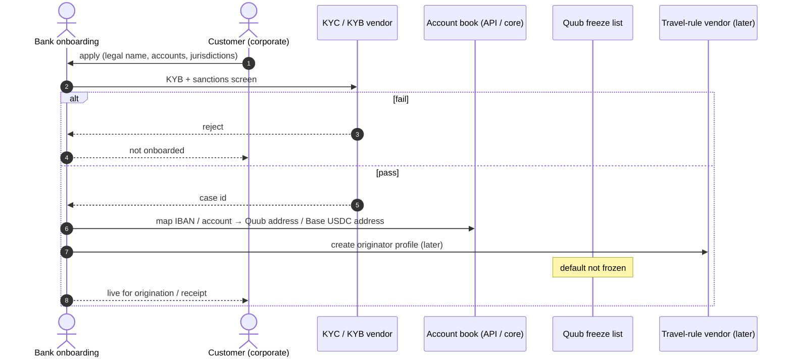

**Quub does not:** host the KYC documents, issue deposit accounts, or run the screening engine.

---

## 2. Beneficiary setup

Customer registers who they are allowed to pay.

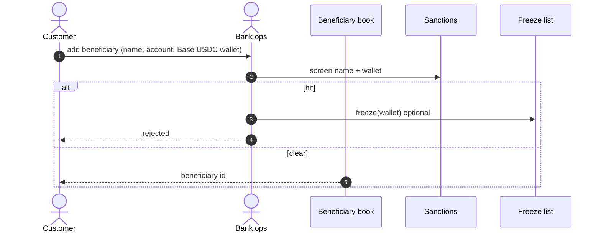

---

## 3. Payment initiation (customer → bank → Quub)

pain.001 / “send money.” Year-1 entry is JSON to `POST /v1/payments`. Later that JSON is filled from pain.001 / pacs.008.

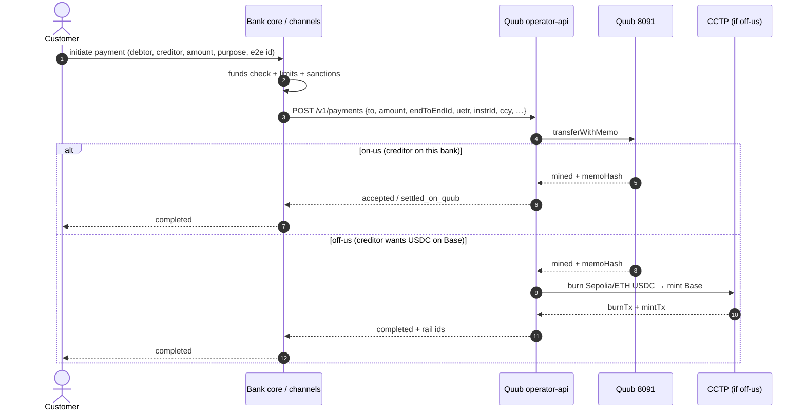

**Idempotency:** same `endToEndId` never creates a second Quub payment.

---

## 4. Request for payment / request to pay

Creditor asks debtor to pay. Quub does not store invoices. The bank does. When the debtor accepts, it becomes use case 3 with the *creditor’s* `endToEndId`.

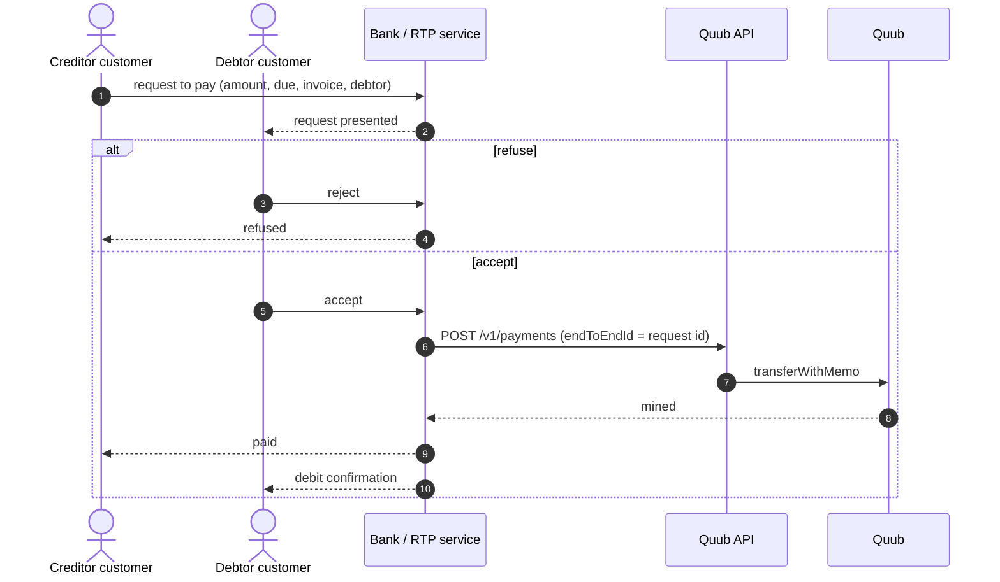

**Now:** request lives in the bank. Quub only sees the resulting payment.  
**Later:** optional `msgType` for RTP vs credit transfer (field already on the memo).

---

## 5. Credit transfer (pacs.008) — interbank

Correspondent or scheme-style credit. Same on-chain memo; different origination.

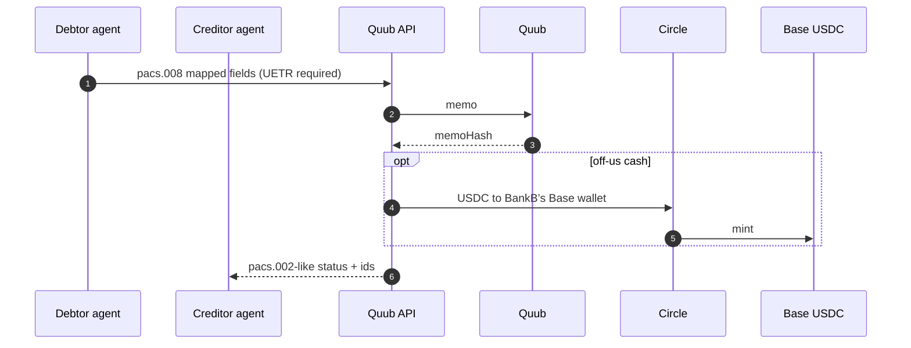

**Now:** JSON body is the pacs.008 field subset.  
**Later:** ingest real pacs.008 XML (C044).

---

## 6. Payment status (pacs.002 / customer status)

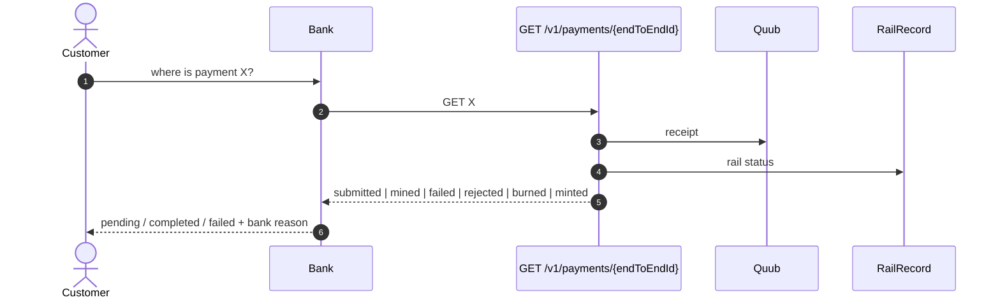

Map: Quub `reason 1` → “blocked by compliance.” CCTP `failed` → “settlement delayed, identity already recorded.”

---

## 7. Cancellation / stop before settlement

If the Quub tx is **not** mined, the API simply does not retry. If it **is** mined, Quub does not rewind. Stop-pay after mine = freeze + off-chain refund process, or a **new** opposite payment (use case 9).

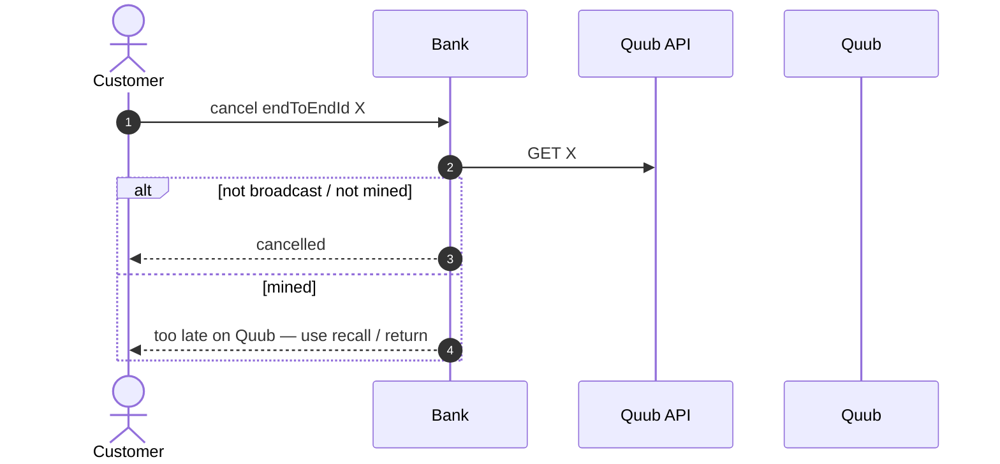

---

## 8. Recall / return (after the money moved)

A new identified payment the other way. Same original `endToEndId` in `packHash` or a linked field — do not reuse the original id as the new payment’s id.

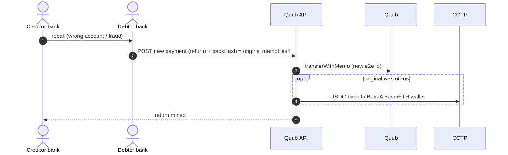

---

## 9. Refund (merchant / platform)

Same as return; initiator is the merchant’s bank. Invoice id = `endToEndId` of the refund, `packHash` = original sale.

---

## 10. Sanctions / freeze (compliance hold)

Customer or beneficiary hits a list. Payments desk freezes **immediately**. Release needs two officers.

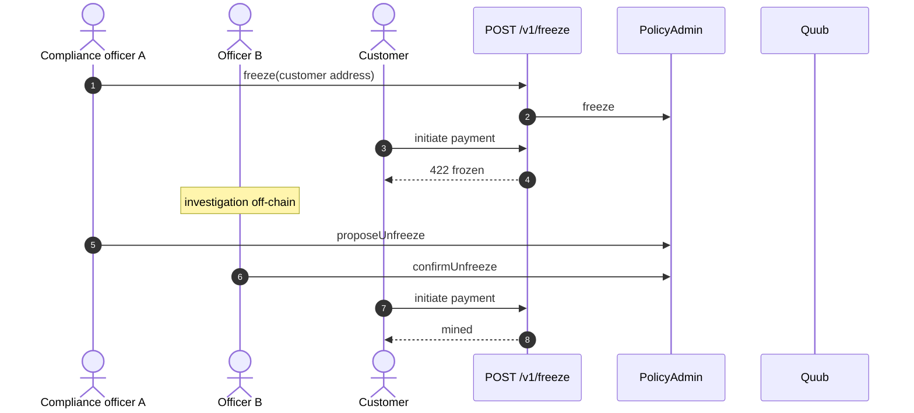

---

## 11. Travel-rule / AML attach

**Now:** `trHash` on the payment; missing hash can be reason 5.  
**Later:** vendor produces the hash; PII never goes on Quub.

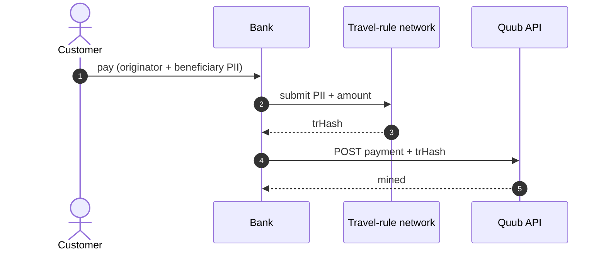

---

## 12. Payroll / bulk disbursement

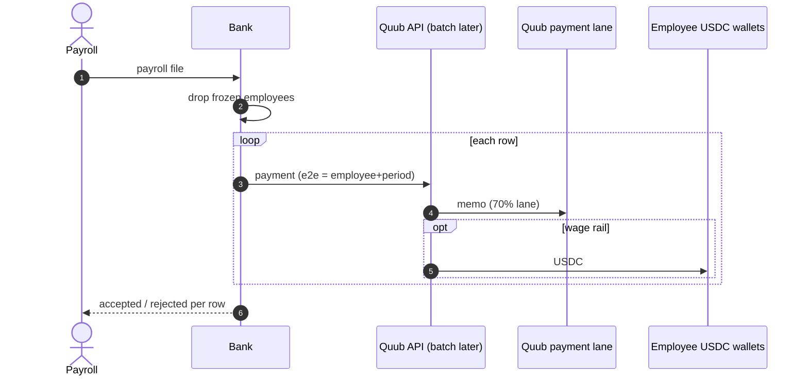

---

## 13. Collections / incoming from another chain

Someone already has USDC on Base and wants it recognized as a collection against an invoice. Year-1 Quub is **originate-then-rail**, not “watch Base and mint on Quub.” Incoming is later: observe mint, then post a Quub memo as the bank’s acknowledgement.

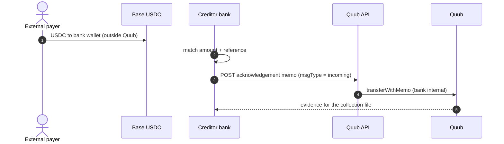

Do not treat a random Base transfer as a Quub settlement without the bank’s memo.

---

## 14. Treasury sweep

Bank moves house funds to a Base treasury wallet it already uses with Coinbase/Circle.

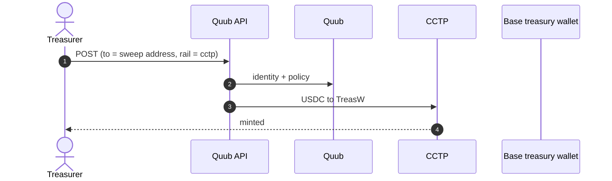

---

## 15. Correspondent payout

Bank A originates; Bank B’s customer receives USDC on Base (or stays on-us if both are on Quub).

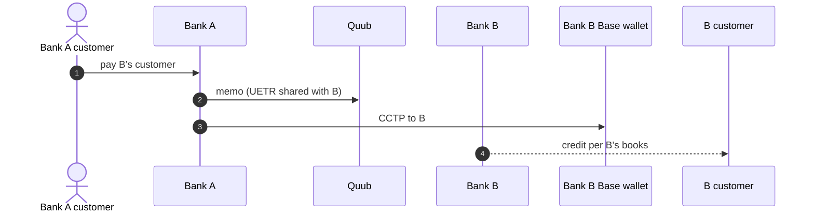

Quub is the shared identity spine. B does not have to run a Quub sequencer; B can be a verifier later (C047) or just take USDC + the `memoHash` in a message from A.

---

## 16. Invoice marketplace / vendor payout

Platform pays vendors. Invoice id = `endToEndId`. Vendor already has a Base address.

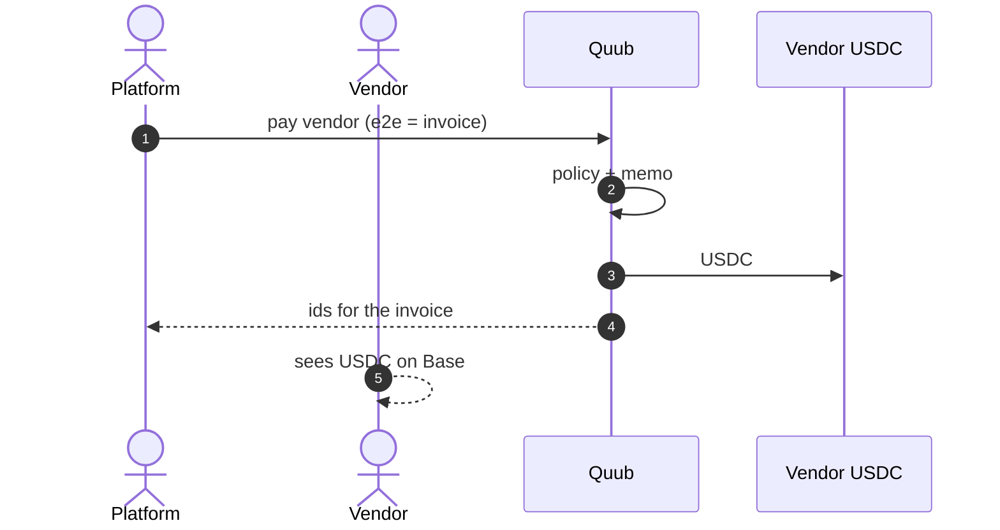

---

## 17. Escrow-like hold (policy, not an escrow VM)

Hold = freeze the payer or the payout address until two officers release. Not a smart-escrow product.

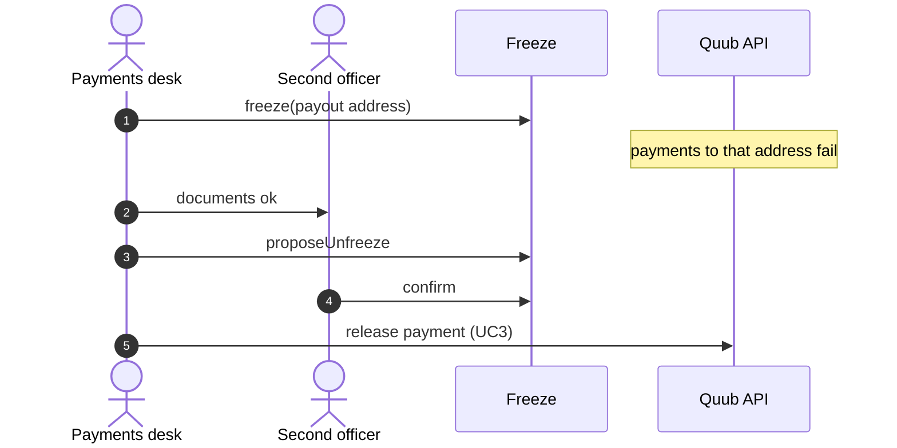

---

## 18. Investigation / dispute file

Ops pulls one `endToEndId` and hands compliance a pack.

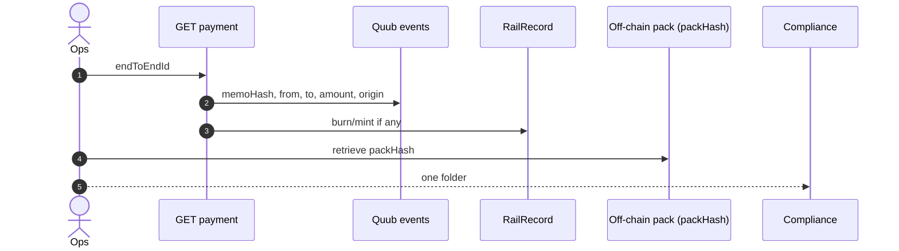

---

## What Quub is not (so these are not use cases)

| Not a use case | Why |
|---|---|
| Open a deposit account | Bank core |
| Card acquiring | Different rail |
| FX engine | Amount is already in one `ccy` |
| Retail self-custody wallet | Year-1 actor is the bank operator |
| “Buy QUUB to pay” | No network token |
| Instant cancel after mine | Immutable memo; use return |

---

## Mapping to what you already shipped

| Business use case | Today | Missing |
|---|---|---|
| Onboarding | Manual address + freeze | KYC vendor, account book |
| Beneficiary | Manual `to` | Screening workflow |
| Initiation | `POST /v1/payments` | pain.001 file |
| Request to pay | Off-chain request | `msgType` convention |
| Credit transfer | Memo fields | pacs.008 XML |
| Status | `GET /v1/payments/{id}` | pacs.002 out |
| Cancel before mine | Don’t send | Explicit cancel API |
| Return / refund | New memo | Link field standard |
| Freeze / unfreeze | API + two-key unfreeze | API two-key wired |
| Travel rule | `trHash` slot | Vendor |
| Payroll | Loop + 70% lane | Batch endpoint |
| Off-us USDC | Sprint 6 rail | Live CCTP keys |
| Incoming collection | Not built | Watch + ack memo |
| Investigation | Events + GET | Extract CSV |
