# Quub — Payment use cases: interactions and sequences
**Chain:** 8091. **Token on Quub:** F210 (QPT dummy on `--dev`). **Dollars off-Quub:** USDC via Circle CCTP.  
**Actors:** Originator, Operator API `:8080`, `quub-iso`, `quub-node`, F201–F213, OwnerA / OwnerB, `quub-gateway`, Circle CCTP, Base (or Sepolia).

Addresses:

| Addr | Role |
|---|---|
| F201 | Policy precompile (caller = F210 only) |
| F202 | ISO memo precompile (hash includes `tx.origin`) |
| F203 | Paymaster precompile (thin) |
| F210 | PaymentToken |
| F211 | PolicyAdmin |
| F212 | EvidenceAnchor |
| F213 | PaymasterEntry |

---

## UC1 — On-us identified payment (happy path)

Originator pays another address on Quub only. No CCTP. This is the Sprint 1.5 / 5 path.

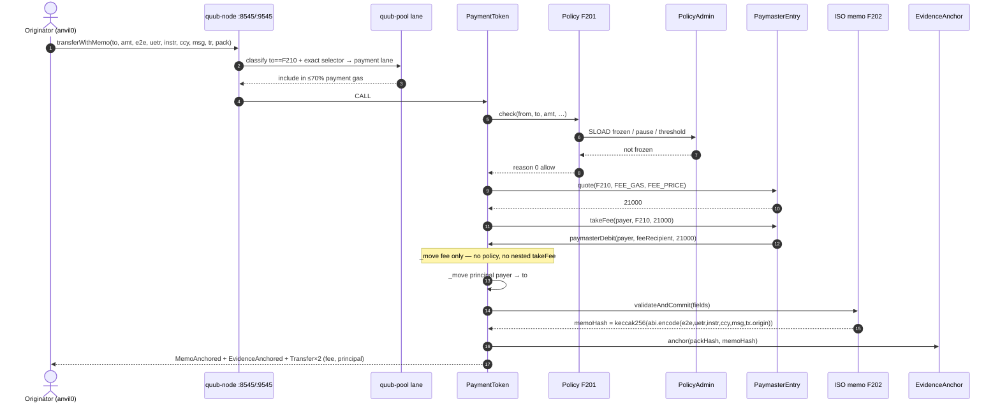

**Fails closed if:** F201 ≠ 0, F213 unlisted token, F201 called by EOA, calldata length ≠ memo.

---

## UC2 — Same payment through the operator API

Bank/ops does not speak Solidity. Sprint 4.

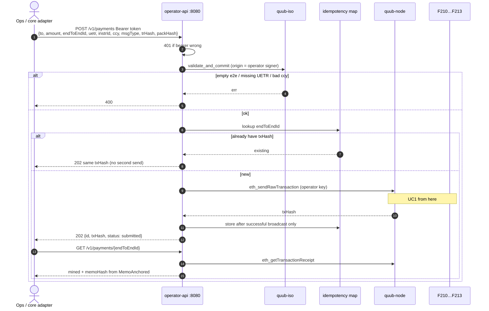

---

## UC3 — Policy reject (frozen sender)

Sanctions / stop-pay. Fee and principal must not move. Rail must not burn.

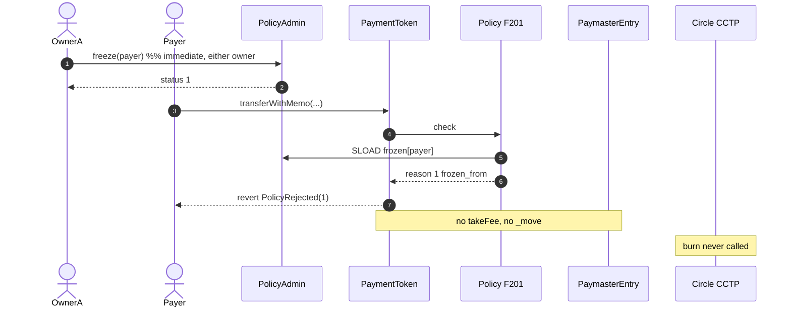

API shape: `POST /v1/freeze` then `POST /v1/payments` → **422** `{error: policy_rejected, reason: 1, reasonName: frozen_from}`.

---

## UC4 — Unfreeze (maker-checker)

Sprint 5. Same key twice is not dual-control.

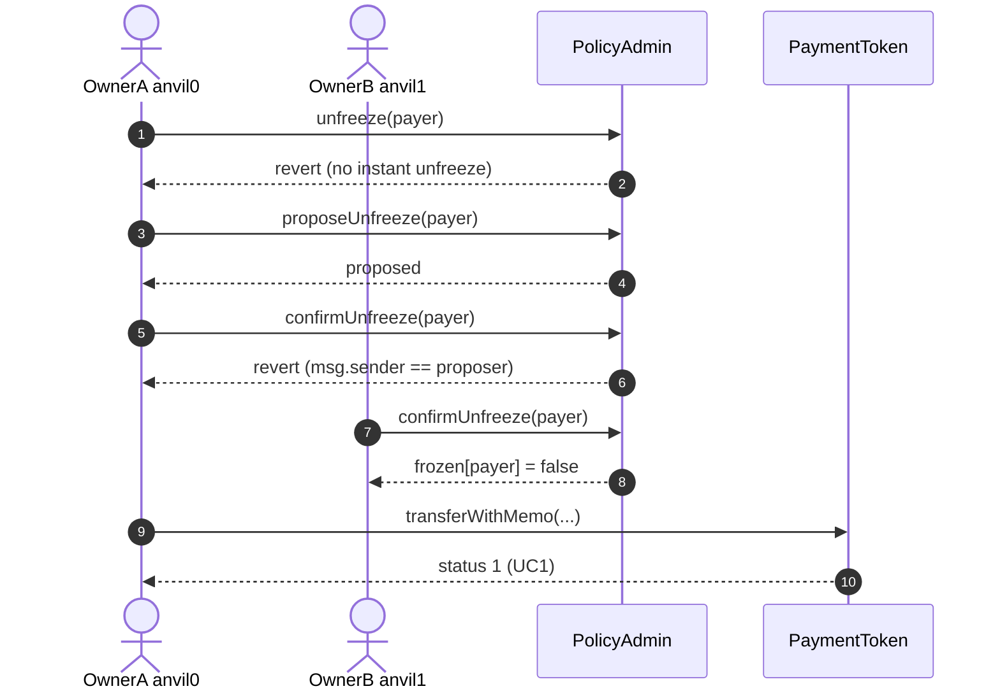

Mode A L2 genesis may still have OwnerA = OwnerB (`STATUS.md`). On that env this diagram is **not** true until Sprint 7 / C034.

---

## UC5 — Pause / threshold (two-key params)

Freeze stays one-key. Pause is not freeze.

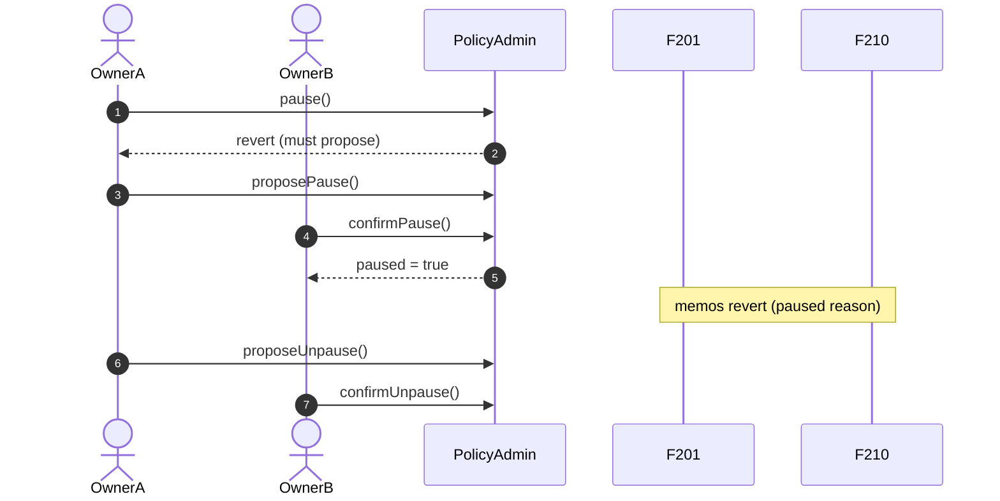

`setFeeToken` / `setThreshold` same propose+confirm pattern.

---

## UC6 — Fee vs free transfer

Only identified memos pay F213. General-lane `transfer` does not.

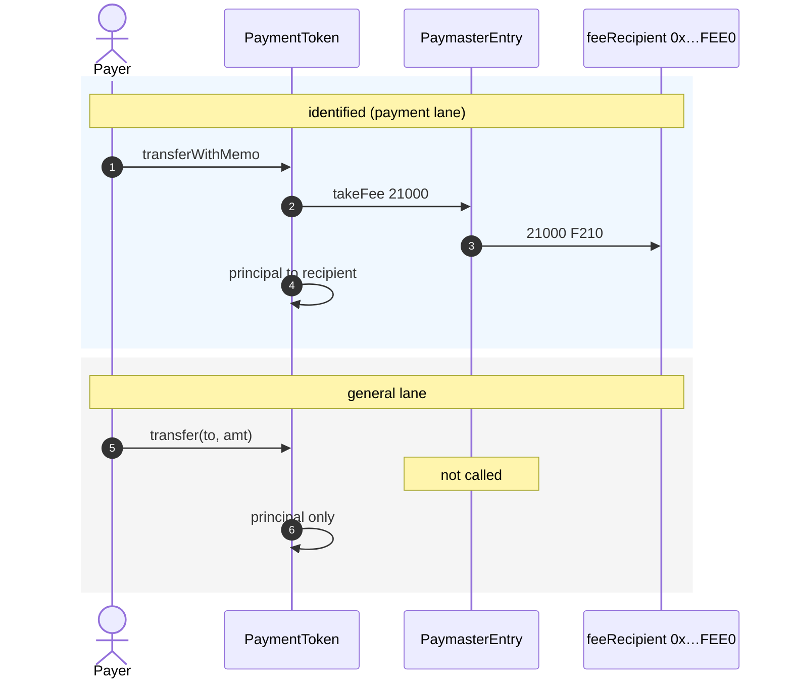

---

## UC7 — Payment lane vs high-tip junk

Sprint 3. Lane beats gas price.

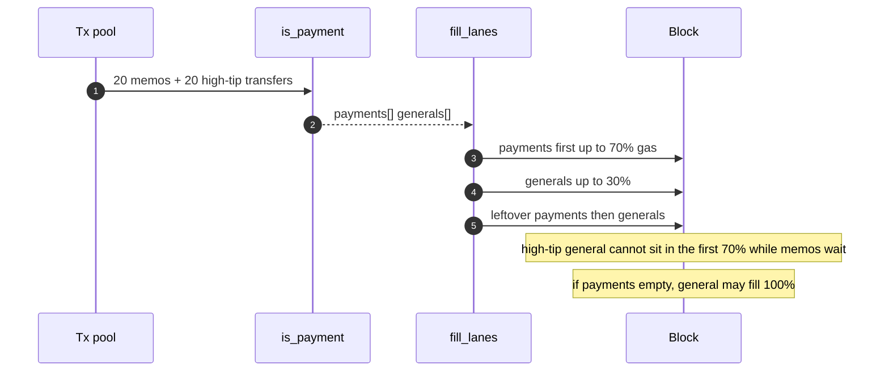

---

## UC8 — Off-us: Quub identity + CCTP USDC to Base (happy)

Sprint 6. Quub is **not** a CCTP domain. Two ledgers, one `endToEndId`.

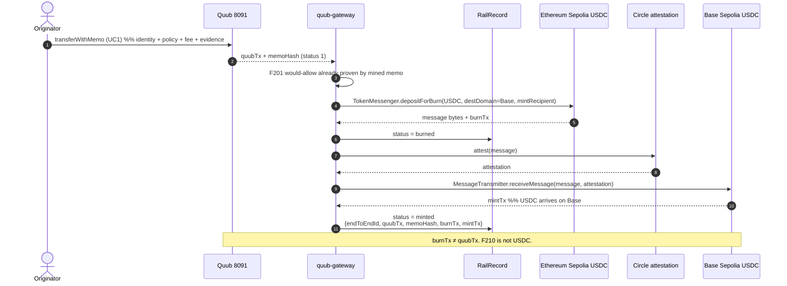

Mock mode: Sep/Cir/Base are in-process fixtures; ids still printed.

---

## UC9 — Freeze blocks the rail

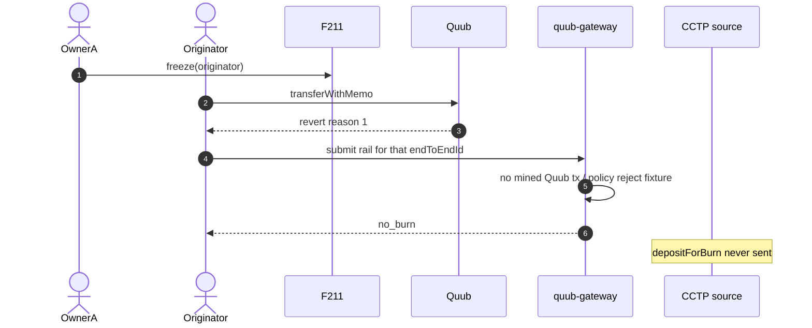

If they try rail-only (skip Quub): **forbidden**. Gateway must require a mined memo (or an eth_call that F201 would allow *and* then mine — year-1 requires the mine first).

---

## UC10 — CCTP fails after Quub already mined

Do not rewind F210. Do not post a second memo.

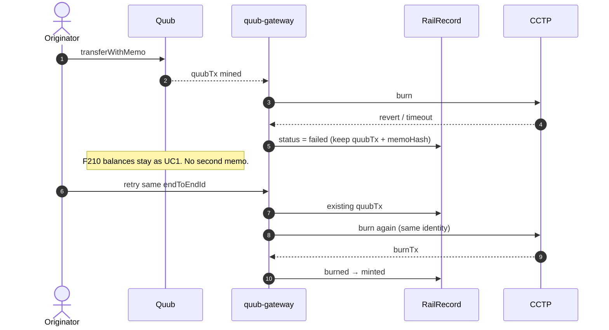

---

## UC11 — Idempotent replay (API + rail)

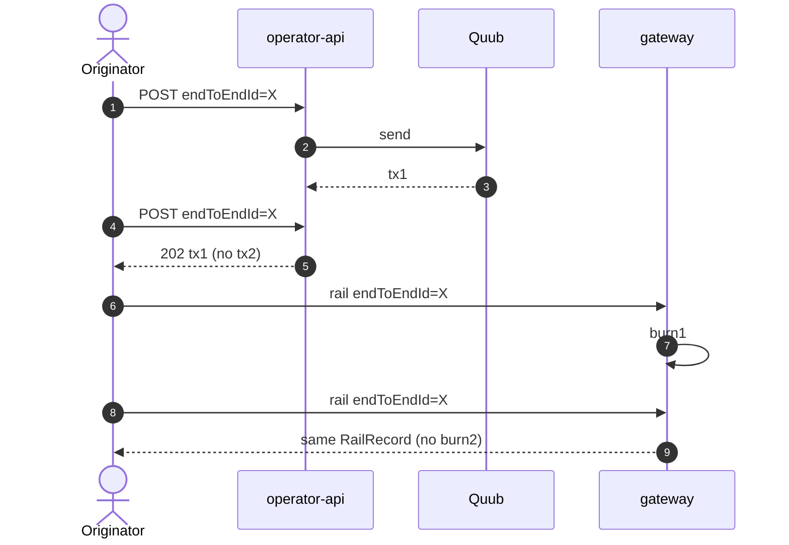

Failed first broadcast is **not** stored as success (Sprint 4 lock). After unfreeze, same `endToEndId` may be retried only if no successful Quub tx exists.

---

## UC12 — On-us vs off-us (same body, `rail` flag)

Planned C048. Default `quub`.

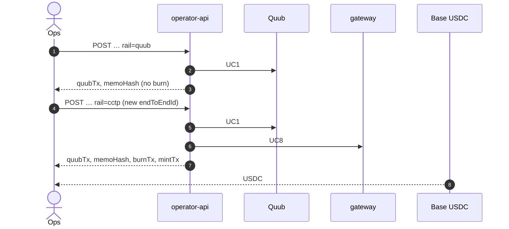

---

## UC13 — Mode A vs `--dev` (same payment, different consensus)

Not a different payment. Different physical path.

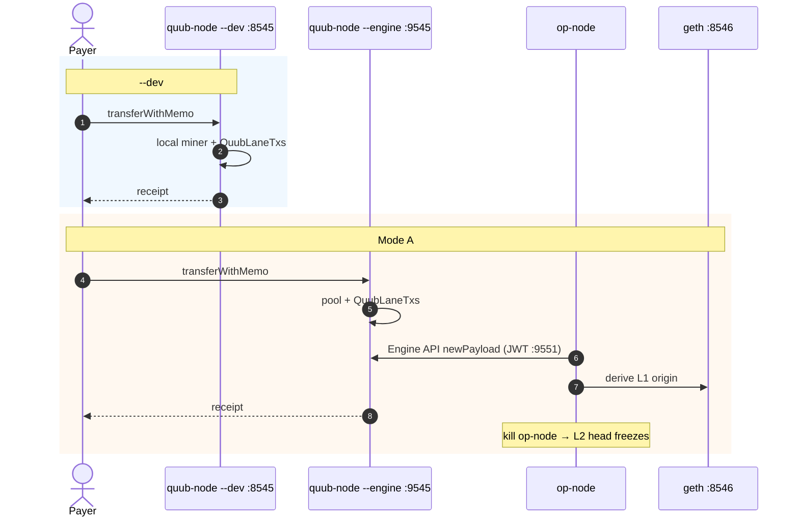

---

## UC14 — Batch disbursement (planned C049)

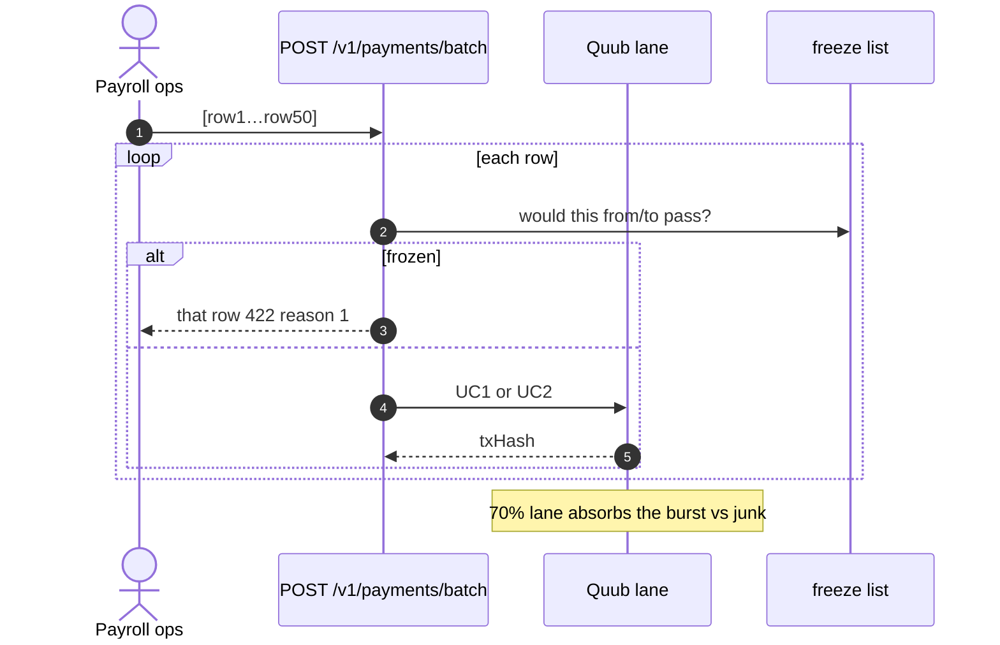

Per-item status, not one atomic revert of the whole file.

---

## UC15 — Travel-rule missing (reason 5)

Field exists today; vendor is later (C045).

```mermaid
sequenceDiagram
  autonumber
  actor Ops as Ops
  participant API as API
  participant F201 as Policy
  participant Vendor as TRP / Sumsub (later)

  Ops->>API: trHash = 0x00… and policy requires TR
  API->>F201: check
  F201-->>API: reason 5 missing_travel_rule
  API-->>Ops: 422 reason 5
  Note over Vendor: later: vendor receipt → trHash; PII stays off-chain
```

---

## Field map (every memo)

| JSON / ISO | On-chain arg | Who sets it |
|---|---|---|
| `to` | `address to` | creditor address book |
| `amount` | `uint256` | minor units of F210 / instruction |
| `endToEndId` | `bytes32` | core / ops — idempotency key |
| `uetr` | `bytes16` | ISO UETR |
| `instrId` | `bytes32` | instruction id |
| `ccy` | `bytes3` | e.g. USD |
| `msgType` | `uint8` | 0 = pacs.008 class |
| `trHash` | `bytes32` | travel-rule commitment |
| `packHash` | `bytes32` | off-chain evidence pack |
| (implicit) | `tx.origin` | signer; inside F202 hash |

---

## What never appears in a payment sequence

- A QUUB ticker buy-in
- `depositForBurn` on chain 8091
- Anvil as SystemConfig L1
- Instant `unfreeze` from the same key
- A second `transferWithMemo` to “fix” a failed CCTP
- EOA calling F201 / F213 `takeFee`
